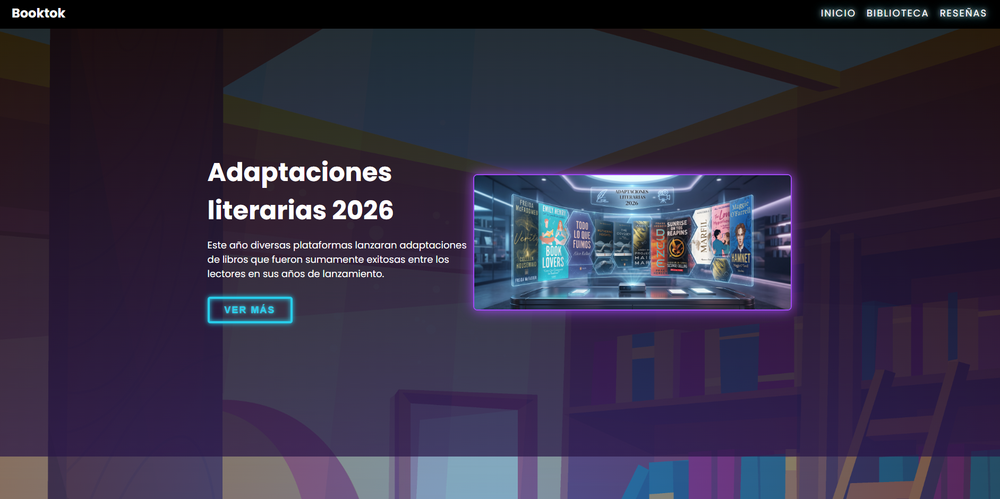
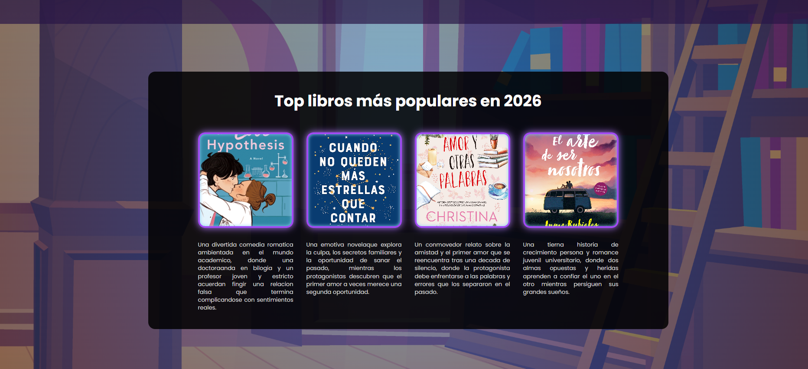
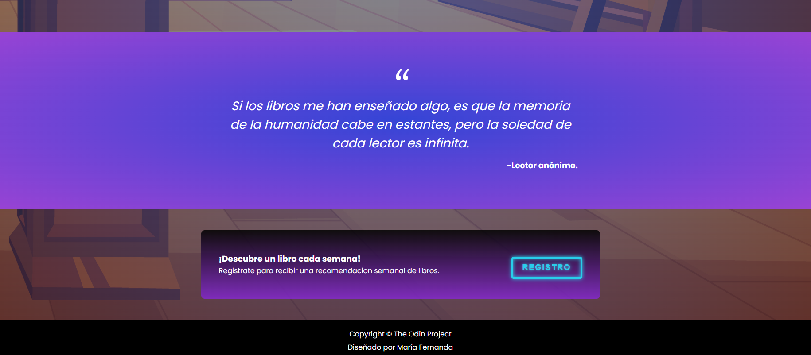

# Landing-Page
# The Odin Project: Landing Page

This is the webpage I made to the **[Landing Page project](https://www.theodinproject.com/lessons/foundations-landing-page)** of The Odin Project.

The purpose of this project is to apply all the concepts learned in the Flexbox part of The Odin Project's Foundations curriculum.

Design used as a reference:

My finished webpage for this project (or [click here](https://goldenvante.github.io/Landing-Page/) to see a live preview):

